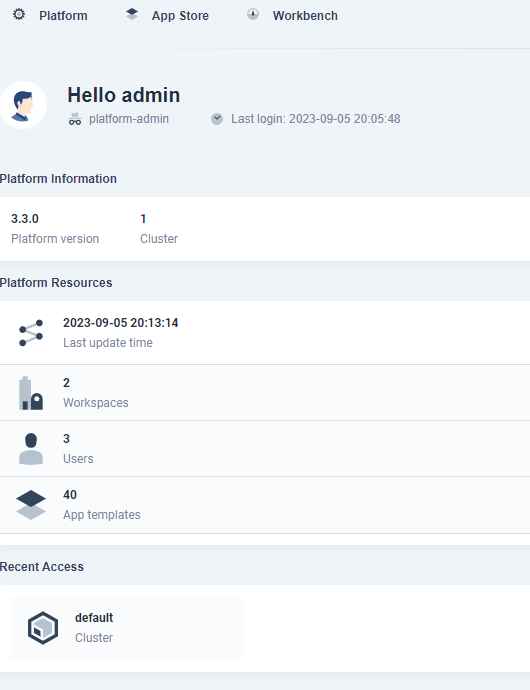

## Istallation
安装KubeSphere首先要设置
```
export KKZONE=cn
```
dependencies need to be installed before installing kubernetes after version 1.18

|software|level|
|:-|:-|
|socat|Required|
|conntrack|Required|
|ebtables|Optional but recommended|
ipset	|Optional but recommended
ipvsadm	|Optional but recommended

## Users
|name|role|email|password|
|:-|:-|:-|:-|
|admin|system manager|lingjian99@yeah.net|Lingjian99|
|jian| workspace_manager|lingjian99@yeah.net|Lingjian99|
|arnold| platform_regular | arnod104@yeah.net |Passw0rd|


## Structure

1 cluster(default cluster), 2 workspace(system-workspace, kuaima-ling)

kuaima-ling include 1 project(kuaima-mock), 2 users

在App store选 etcd 安装。etcd 安装到 project(defualt clustar -> kuaima-ling -> kuaima-monk) 中

## Workspace

### Create and manage Workspace

Tap "Workbench" on the left_upper corner to turn to the page show as figure 1, tap 'Workspace' into the page show as figure 2 

<p><br>fig. 1</img></p>
<p><br>fig. 2</img>

---
name: kuaima-ling(Kuaima)
manager: jian


## Project

name kuaima-mock


## other

如果需要修改Node的hostname，在Cluster/Nodes界面修改

如果需要安装Loadbalance，kubesphere推荐使用
https://github.com/openelb/openelb

	
Users：
|Name|email|Platform Role|
|:-|:-|:-|	
|arnord|arnold104@yeah.net|workspaces-manager|	
|jian|lingjian99@yeah.net|platform-admin|
|admin|admin@kubesphere.io|platform-admin|	


## Add a worker node
> reference: https://www.kubesphere.io/zh/docs/v3.3/installing-on-linux/cluster-operation/add-new-nodes/#%E6%B7%BB%E5%8A%A0%E5%B7%A5%E4%BD%9C%E8%8A%82%E7%82%B9

先从主机（其他node上也可以吧？）上生成一个yaml文件，修改文件，添加node信息。然后使用kk安装，在安装前kk会检查待添加的node是否满足安装要求，其中socat和ipset是必须的，docker和container会自动安装。


| name |sudo|curl| openssl |ebtables|socat| ipset |ipvsadm| conntrack |chrony|docke|containerd | nfs client |ceph client | glusterfs client | time |
|-:|-:|-:|-:|-:|-:|-:|-:|-:|-:|-:|-:|-:|-:|-:|-:|
| ks.master.1 | y | y | y  | y  | y | y  |  | y | y | 20.10.8 | v1.4.9  | y | | y | PDT 01:15:02 |
| ks.node.1   | y | y | y  | y  | y | y  |  | y | y |         |         | y | | y | PDT 01:15:02 |


在node上先执行
```
export KKZONE=cn
```

安装socat和ipset
```
yum install -y socat
yum install -y ipset
```
在主机上执行
```
./kk add nodes -f sample.yaml
```

## Install load balancer (here is OpenEBL)
> reference: https://github.com/openelb/openelb

